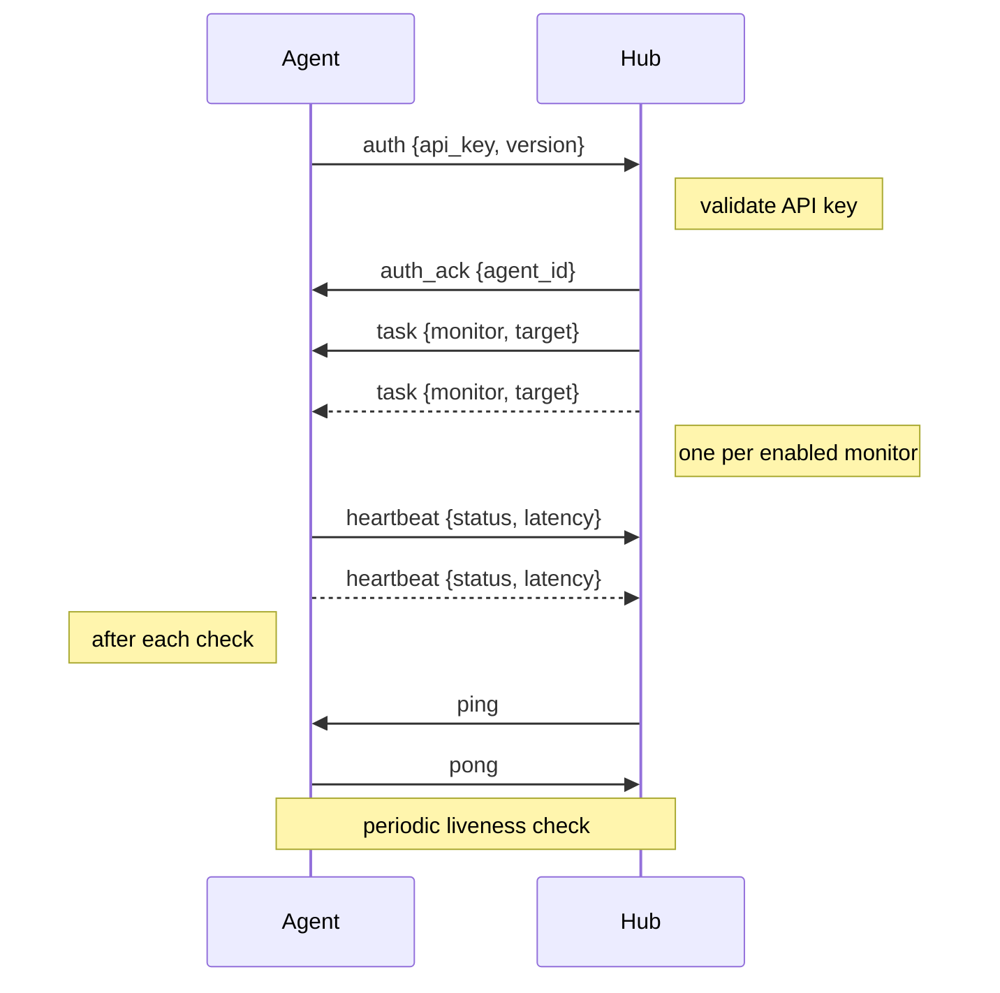

```
██╗    ██╗ █████╗ ████████╗ ██████╗██╗  ██╗██████╗  ██████╗  ██████╗
██║    ██║██╔══██╗╚══██╔══╝██╔════╝██║  ██║██╔══██╗██╔═══██╗██╔════╝
██║ █╗ ██║███████║   ██║   ██║     ███████║██║  ██║██║   ██║██║  ███╗
██║███╗██║██╔══██║   ██║   ██║     ██╔══██║██║  ██║██║   ██║██║   ██║
╚███╔███╔╝██║  ██║   ██║   ╚██████╗██║  ██║██████╔╝╚██████╔╝╚██████╔╝
 ╚══╝╚══╝ ╚═╝  ╚═╝   ╚═╝    ╚═════╝╚═╝  ╚═╝╚═════╝  ╚═════╝  ╚═════╝
                             Proto
```
**Shared WebSocket Message Protocol**

> Part of [WatchDog](https://github.com/sylvester-francis/watchdog) — live at [usewatchdog.dev](https://usewatchdog.dev)


[Installation](#installation) · [Quick Start](#quick-start) · [Message Types](#message-types) · [Payload Types](#payload-types)

---

## What is watchdog-proto?

A minimal, zero-dependency Go package that defines the JSON message protocol used by the [WatchDog Hub](https://github.com/sylvester-francis/watchdog) and [WatchDog Agent](https://github.com/sylvester-francis/watchdog-agent) to communicate over WebSocket connections. It provides typed message envelopes, payload structs, and helper constructors.

This is part of the [WatchDog](https://github.com/sylvester-francis/watchdog) monitoring system, the only open-source monitoring tool with native agent-based distributed architecture.

## Installation

```bash
go get github.com/sylvester-francis/watchdog-proto@latest
```

## Quick Start

```go
import "github.com/sylvester-francis/watchdog-proto/protocol"

// Agent -> Hub: authenticate
msg := protocol.NewAuthMessage("my-api-key", "1.0.0")

// Agent -> Hub: report check results
msg := protocol.NewHeartbeatMessage("monitor-uuid", "up", 42, "")

// Hub -> Agent: assign monitoring task
msg := protocol.NewTaskMessage("monitor-uuid", "http", "https://example.com", 30, 10)

// Parse an incoming message payload
var payload protocol.HeartbeatPayload
if err := msg.ParsePayload(&payload); err != nil {
    log.Fatal(err)
}
```

## Message Envelope

Every message uses the same envelope format:

```json
{
  "type": "heartbeat",
  "payload": { ... },
  "timestamp": "2025-01-15T10:30:00Z"
}
```

```go
type Message struct {
    Type      string          `json:"type"`
    Payload   json.RawMessage `json:"payload,omitempty"`
    Timestamp time.Time       `json:"timestamp"`
}
```

## Message Types

| Type | Direction | Description |
|------|-----------|-------------|
| `auth` | Agent -> Hub | Agent sends API key to authenticate |
| `auth_ack` | Hub -> Agent | Hub confirms successful authentication |
| `auth_error` | Hub -> Agent | Hub rejects authentication |
| `task` | Hub -> Agent | Hub assigns a monitoring task |
| `heartbeat` | Agent -> Hub | Agent reports check results |
| `ping` | Hub -> Agent | Hub checks agent liveness |
| `pong` | Agent -> Hub | Agent responds to ping |
| `error` | Either | Generic error message |

## Payload Types

### AuthPayload

```go
type AuthPayload struct {
    APIKey  string `json:"api_key"`
    Version string `json:"version,omitempty"`
}
```

### AuthAckPayload

```go
type AuthAckPayload struct {
    AgentID   string `json:"agent_id"`
    AgentName string `json:"agent_name"`
}
```

### AuthErrorPayload

```go
type AuthErrorPayload struct {
    Error string `json:"error"`
}
```

### TaskPayload

```go
type TaskPayload struct {
    MonitorID string `json:"monitor_id"`
    Type      string `json:"type"`       // "http", "tcp", "ping", "dns", "tls"
    Target    string `json:"target"`     // URL, host:port, or hostname
    Interval  int    `json:"interval"`   // Check interval in seconds
    Timeout   int    `json:"timeout"`    // Check timeout in seconds
}
```

### HeartbeatPayload

```go
type HeartbeatPayload struct {
    MonitorID      string `json:"monitor_id"`
    Status         string `json:"status"`                      // "up", "down", "timeout", "error"
    LatencyMs      int    `json:"latency_ms,omitempty"`
    ErrorMessage   string `json:"error_message,omitempty"`
    CertExpiryDays *int   `json:"cert_expiry_days,omitempty"`  // TLS checks only
    CertIssuer     string `json:"cert_issuer,omitempty"`       // TLS checks only
}
```

### ErrorPayload

```go
type ErrorPayload struct {
    Code    string `json:"code"`
    Message string `json:"message"`
}
```

## Helper Constructors

| Function | Creates |
|----------|---------|
| `NewAuthMessage(apiKey, version)` | `auth` message |
| `NewAuthAckMessage(agentID, agentName)` | `auth_ack` message |
| `NewAuthErrorMessage(err)` | `auth_error` message |
| `NewTaskMessage(monitorID, type, target, interval, timeout)` | `task` message |
| `NewHeartbeatMessage(monitorID, status, latencyMs, errorMsg)` | `heartbeat` message |
| `NewPingMessage()` | `ping` message |
| `NewPongMessage()` | `pong` message |
| `NewErrorMessage(code, message)` | `error` message |
| `NewMessage(msgType, payload)` | Any type (returns error) |
| `MustNewMessage(msgType, payload)` | Any type (panics on error) |

## Connection Lifecycle



## Dependencies

None. Uses only the Go standard library (`encoding/json`, `time`).

## Related Repositories

| Repository | Description |
|------------|-------------|
| [watchdog](https://github.com/sylvester-francis/watchdog) | Hub server — dashboard, API, alerting, data storage |
| [watchdog-agent](https://github.com/sylvester-francis/watchdog-agent) | Monitoring agent binary |

## License

MIT License. See [LICENSE](LICENSE) for details.
